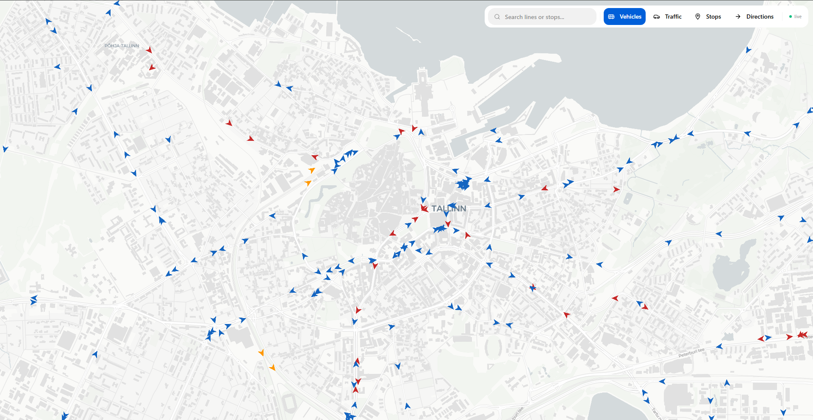
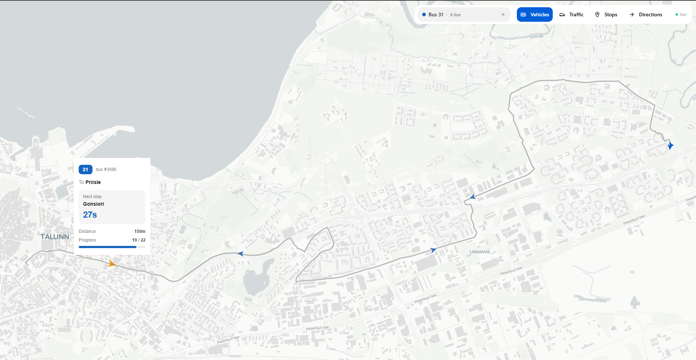
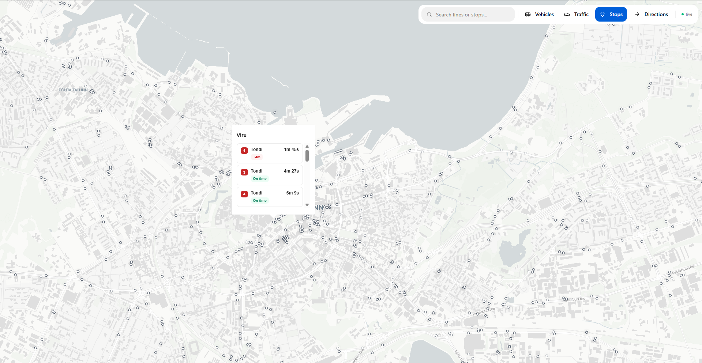
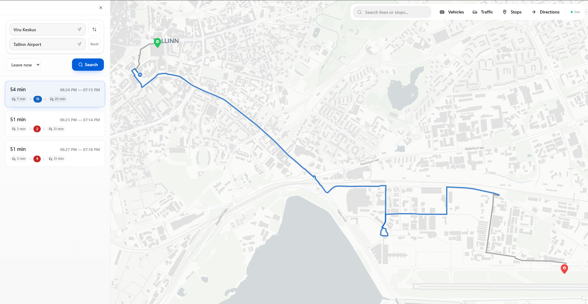
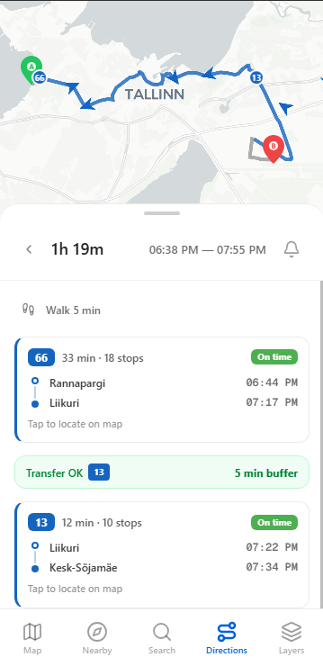
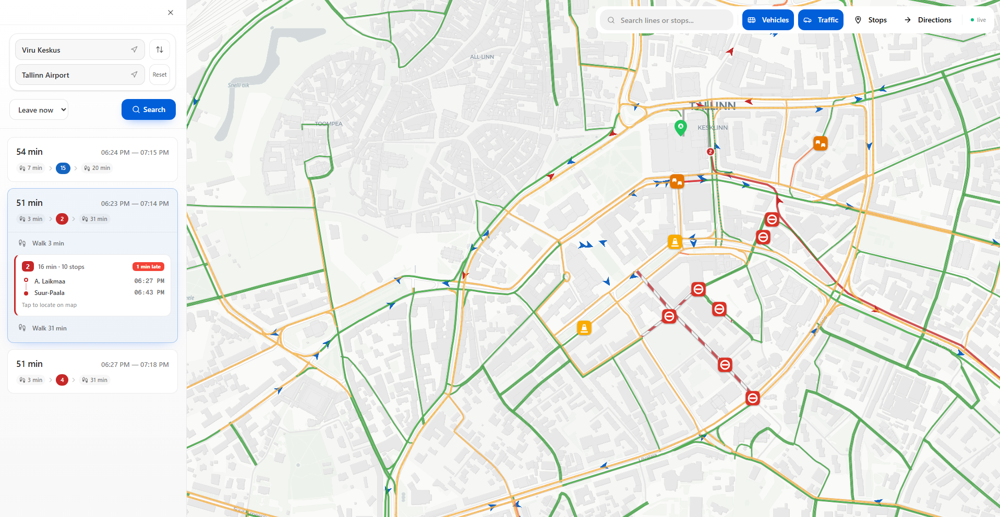

## Why I built this

One day my bus was 8 minutes late, I was standing outside with gloves on and checking updates on my phone was frustrating.

Tallinn already provides a live transit map, but on mobile it felt clunky, especially in cold weather with gloves on.
At the same time, I still needed Google Maps for route planning, so I kept jumping between apps.

I wanted one place where everything is easy to access: live vehicle positions, real-time delays, stop departures, and route planning.

This is a real-time public transport app for Tallinn, Estonia.
It helps you answer the practical questions quickly:
- Where is my bus right now?
- Is it running late?
- What is the fastest way to get there?

**Try it live:** [transit-tracker-production.up.railway.app](https://transit-tracker-production.up.railway.app/)

## What you can do

### Live vehicle map

Watch buses, trams, and trains move on an interactive map in real time. Each vehicle type has its own color, so it is easy to scan the map fast.

### Vehicle details

Tap any vehicle to see the line number, destination, next stop, and route progress. The full route shape is shown on the map so you can see exactly where it is headed.

### Stop departures

Open any stop to get upcoming arrivals with live delay status: early, on time, or late.

### Route planner

Enter a start and destination to get route options across the city. Each option includes walking segments, transit legs, and estimated travel time.

Expand any option for full details: departure and arrival stops, scheduled times, and live delay for each transit leg.

### Leave reminders

Set a reminder on a planned trip and get a push notification when it is time to leave, based on the current live departure data.

### Mobile friendly

The app works as a Progressive Web App (PWA). Add it to your home screen and use it like a native app. The layout is optimized for smaller screens with bottom navigation and swipeable panels.

  

### Traffic overlay

Turn on the traffic layer to see live traffic flow and incidents (accidents, road works, closures) together with transit data.

## Data sources

The app combines several public feeds and APIs:

- **Vehicle locations:** [Tallinn public GPS feed](https://gis.ee/tallinn/gps.php)
- **Stop departures (scheduled + expected):** [Tallinn Transport SIRI feed](https://transport.tallinn.ee/siri-stop-departures.php)
- **Routes, stops, and timetables:** [GTFS data via peatus.ee](https://peatus.ee)
- **Route planning and place search:** [Google Routes API](https://developers.google.com/maps/documentation/routes)
- **Traffic flow and incidents:** [TomTom Traffic API](https://developer.tomtom.com/)
- **Map rendering:** [MapLibre GL](https://maplibre.org/)

Transit coverage is focused on Tallinn and the surrounding Harju County area.
